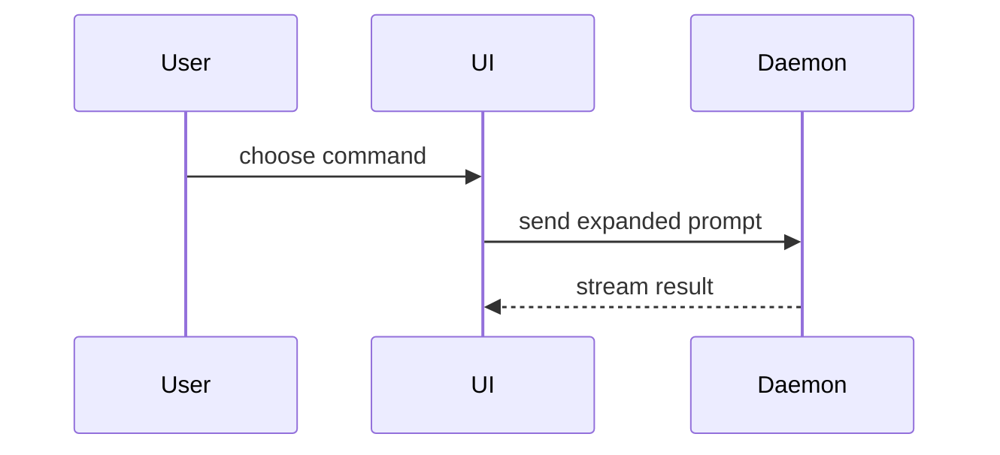

# show-me

The user did not follow an explanation and wants to see it instead. The
target is the text supplied with the skill invocation, or the most recent explanation in this conversation
if that is empty. Skip the preamble and keep prose brief. Do not repeat the
earlier explanation in words; the visual replaces it. Pick the smallest view
that makes the key point clear.

Do this yourself, in the conversation. Do not hand it to a subagent: the
material is the conversation so far, which a subagent does not have, and
its output would not reach the user.

- Show logic or an algorithm as pseudocode:

```text
on(save)
  if content is unchanged
    return cached result
  write new content
  return fresh result
```

- Show runtime control flow as a call tree:

```text
submitForm
  createSession
    persistPrompt
    launchAgent
  navigateToSession
```

- Show UI structure as a component tree, including state and module
  boundaries that matter:

```tsx
<SessionPage> (apps/example/src/routes/session.tsx)
  useSessionEvents()
  <SessionToolbar>
    <RunSkillButton> (packages/ui)
```

- Show file responsibility or a broad refactor as a shallow file tree:

```text
src/
├── commands/       # parses user actions
├── sessions/       # owns session state
└── transport/      # sends API requests
```

- Show component interaction, control flow, or data flow with Mermaid. A
  terminal shows Mermaid as source, not as a picture, so keep it small
  enough to read as source; a diagram that has to be rendered to be
  understood goes in the HTML file below.



- Use `diff` when the point is what changes and the surrounding shape
  already exists. Match the diff shape to the topic.

For a component change:

```diff
 <SessionPage>
   useSessionEvents()
   <SessionToolbar>
+    <RunSkillButton />
   <SessionTimeline>
+    <SkillResultCard />
```

For a file-layout change:

```diff
 src/
 ├── commands/
+│   └── show-me.ts       # expands the slash command
 ├── sessions/
-└── transport.ts
+└── transport/
+    ├── client.ts
+    └── stream.ts
```

For a call-tree or call-stack change:

```diff
 submitForm
   createSession
     persistPrompt
+    expandSkillMention
     launchAgent
-  navigateToSession
+  navigateToSession
+    subscribeToEvents
```

For a state or control-flow change:

```diff
 on(save)
-  write content
+  if content is unchanged
+    return cached result
+  write new content
+  invalidate cache
```

- Show the whole block when most of it is new, when omitted context would
  hide ownership or order, or when the user needs a copyable target shape:

```ts
function expandSkill(command: string): string {
  const skillName = command.slice(1)
  return `use the ${skillName} skill`
}
```

- For a visual UI, layout, state comparison, or concept too dense for
  Mermaid, write one focused HTML file: a diagram, an infographic, or a
  short slide deck, whichever fits the point. When the topic is a product
  UI, match its colors, type, spacing, and components; use real labels and
  data; support desktop and mobile. Write it to a temp or scratch
  directory, not into the repository, then open it for the user:

```
open path/to/show-me-{description}.html
```

## Guidance

Place each visual next to the short text it supports. Keep only the calls,
files, props, states, and boundaries needed to answer the user's current
question or the options to resolve the current discussion point. Use the
real names from the code or the conversation, not placeholders; the
examples above only show the shape.

You may use one of these, you may use several, it is unlikely you will use
all of them. Use your judgement and don't overwhelm the user.
